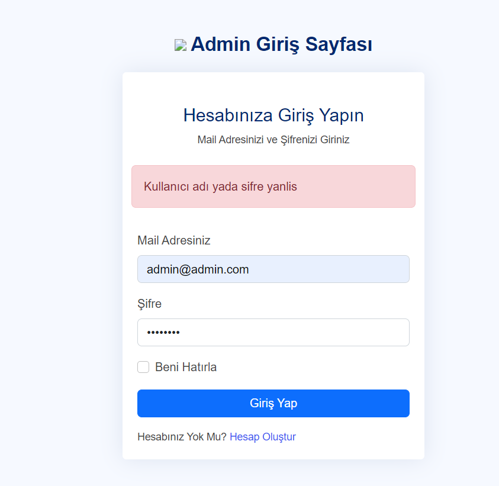
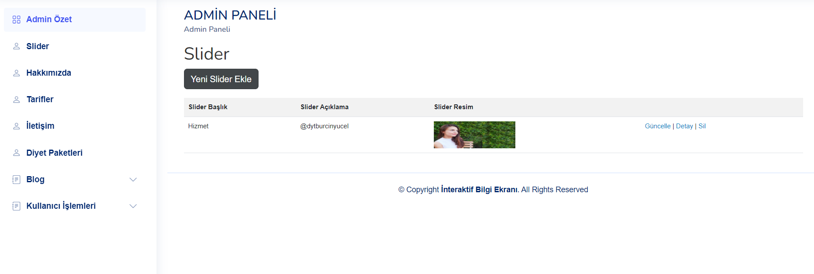
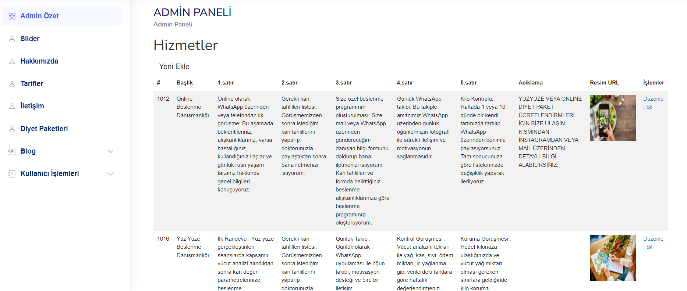
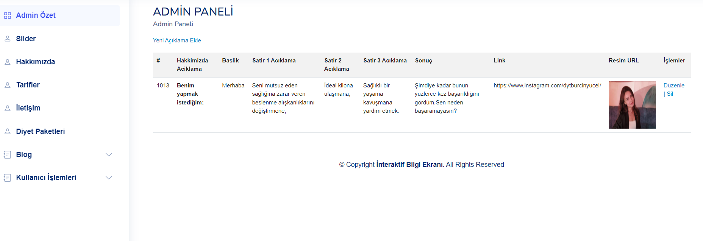

# DiyetisyenWebSayfasi
Admin Panel tarafindan güncellenebilen dinamik web sitesi.(mobil uyumlu)
 
Site Adresi : 
 

Bu projede diyetisyen web sayfası , admin panel tarafından kontrol edilebilir şekilde tasarlanmıştır. SLider ekranı güncellenebilir , foto ,video eklenip ,silinebilir ve güncellenebilir.
Üst banner da yer alan her alan admin paneli tarafından kontrol edilebilir. 

### 1-Admin/Yönetici Rolü 

* :ear: ​**Kullanıcı İşlemleri :** Yönetici **Admin Paneli** aracılığı ile  sayfadaki bilgiler eklenebilir, silinebilir ve güncellenebilir.
  

  ***Admin Paneline Ait Sayfalar***
  -->Slider ekranı
   
  
  -->Hizmetler Sayfası
   
  
  -->Hakkımızda Sayfası
   
  

    ## :computer: Projenin Kurulumu

   Proje’yi çalıştırmak için SQL Server Management Studio Management Studio 19’ın bilgisayarınızda yüklü olması gerekmektedir. Bu kurulumu tamamladıktan sonra veritabanlarımızın yerel sunucumuzda oluşmasını sağlamak için projemizi açıyoruz. Başlangıç projemizi **Kurumsal.Web** olarak belirledikten sonra package manager console’umuzda varsayılan projemizi **KurumsalWeb** olarak belirliyor ve **update-database** komutunu giriyoruz.Bu işlemden sonra veritabanımız yerel sunucumuz içerisinde oluşuyor.

  <h2> 🛠 &nbsp;Kullanılan Teknolojiler</h2>

<table style"float:right;">
  <tr>
    <td></td>
    <td></td>
    <td></td>
  </tr>
  <tr>
    <td></td>
    <td>
    <td></td>
  </tr>
  <tr>
    <td> </td>
    <td></td>
  </tr>
  <tr>
    <td></td>
 		<td></td>
    <td></td>
  </tr>
</table>
